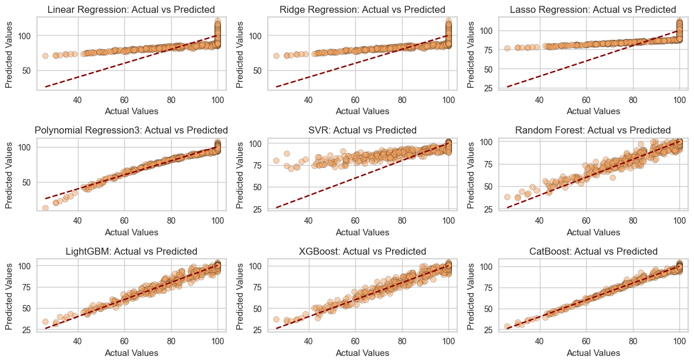

# Air Quality Classification & Regression Project

## Overview
This project addresses the challenge of assessing the health impact of air pollution using machine learning techniques. Both classification and regression models were developed and evaluated to predict health outcomes based on various air quality indicators.


## Table of Contents
- [Key Highlights](#Key-Highlights)
- [Dataset](#dataset)
- [Models Evaluated](#Models-Evaluated)
- [Best Performing Model](#Best-Performing-Model)
- [Key Takeaways](#Key-Takeaways)
- [Project Organization](#Project-Organization)
- [Installation & Usage](#Installation-&-Usage)


## Key Highlights:
- Comprehensive exploratory data analysis (EDA)
- Hyperparameter tuning
- Machine Learning
- Deep Learning


## Benchmarking Regression Models: Actual vs Predicted Performance Comparison



## Dataset
* **Numerical Features:** All features
* **Target Variable:** 

   - HealthImpactScore: A score indicating the overall health impact based on air quality and other related factors, ranging from 0 to 100.

   - HealthImpactClass: Classification of the health impact based on the HealthImpactScore


## Models Evaluated
1. **Classification** - Logistic Regression, CatBoostClassifier
2. **Regression** - CatBoostRegressor, LGBMRegressor, Polynomial Regression
3. **Neural Network**


## Best Performing Model
- **Classification**: Logistic Regression
- **Regression**: CatBoost Regressor


## Key Takeaways
- Both classification and regression are performing at a very high level on their respective tasks, neither modeling strategy demonstrated a clear superiority.


## Project Organization

```
├── LICENSE                               <- Open-source license
├── README.md                             <- Project documentation
├── data
│   ├── raw                               <- Raw Data
│   └── processed                         <- The final, canonical data sets for modeling
│
├── models                                <- Trained models, model predictions, or model summaries
│
├── notebooks                             <- Jupyter notebooks
│   └── 1.0-Air-Quality-prediction.ipynb  <- Code with data preprocessing and models
│
├── reports                               <- Generated analysis
│   └── figures                           <- The most important generated graphics and figures
│
└── requirements.txt                      <- Python dependencies
```


## Installation & Usage
1. Clone the repository:
```bash
https://github.com/Zanyata/Air-Quality-CLASS-REG-ML-NN.git
```
```bash
cd Air-Quality-CLASS-REG-ML-NN
```
2. Install dependencies:
```bash
pip install -r requirements.txt
```
3. Run Jupyter Notebook:
```bash
jupyter notebook
```
Train models & evaluate performance using provided notebooks.


--------